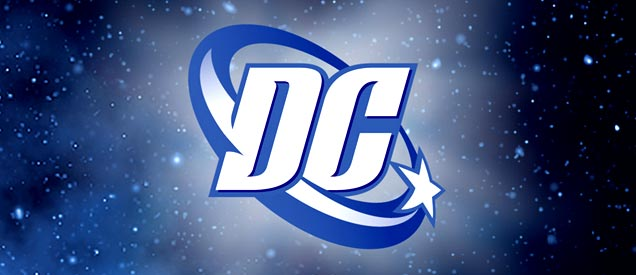
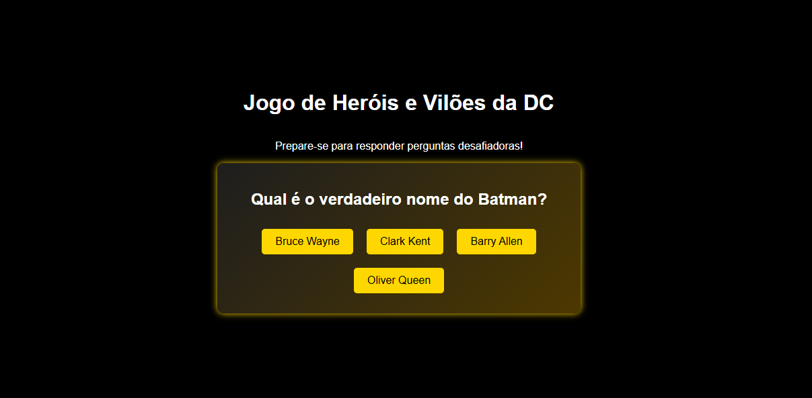

<div align="center">
  
  <h1>Jogo de Heróis e Vilões da DC</h1>
  <p>
     Angular
     React
     GitHub
  </p>
</div>

## Descrição do Projeto
Este é um jogo de múltipla escolha sobre Heróis e Vilões da DC. O objetivo é testar os conhecimentos do jogador com perguntas desafiadoras, onde cada pergunta possui 4 alternativas e o jogador recebe feedback imediato sobre acertos e erros.

## Funcionalidades do Projeto
- Design escuro (preto e dourado)
- Exibição de 10 perguntas sobre o universo DC.
- Cada pergunta possui 4 alternativas.
- O jogador recebe feedback imediato ao responder.
- Sistema de pontuação de 0 a 1000 pontos.
- Troféus baseados na pontuação:

| Troféu   | Ícone | Pontuação |
|----------|:-----:|----------|
| Platina  | 🏆   | 1000 pontos |
| Ouro     | 🥇   | 800+ pontos |
| Prata    | 🥈   | 500+ pontos |
| Bronze   | 🥉   | 200+ pontos |
| Nenhum   | ❌   | Abaixo de 200 pontos |

## Testes de Software
Foram realizados os seguintes testes:
- **Teste de depuração:** Verificação de erros no console e correções no código.
- **Teste de funcionamento:** Jogo testado no navegador para garantir interação correta.
- **Captura do teste realizado:**
  
  

## Tecnologias e Linguagens Utilizadas


## Bibliotecas e Frameworks  


## Documentação do Projeto
- [Documentação do React](https://react.dev/)
- [Documentação do Angular](https://angular.io/docs)
- [Documentação do Node.js](https://nodejs.org/en/docs/)
- [Documentação do GitHub](https://docs.github.com/pt)
- [Documentação do VSCode](https://code.visualstudio.com/docs)
- [Documentação do Git](https://git-scm.com/doc)

---
### Como rodar o projeto localmente
1. Clone o repositório:
   ```sh
   git clone https://github.com/AraujoTech1/jogo-web-dc.git
   ```
2. Acesse a pasta do projeto:
   ```sh
   cd jogo-web-dc
   ```
3. Instale as dependências:
   ```sh
   npm install
   ```
4. Inicie o jogo:
   ```sh
   npm start
   ```
5. Acesse no navegador: `http://localhost:3000`

